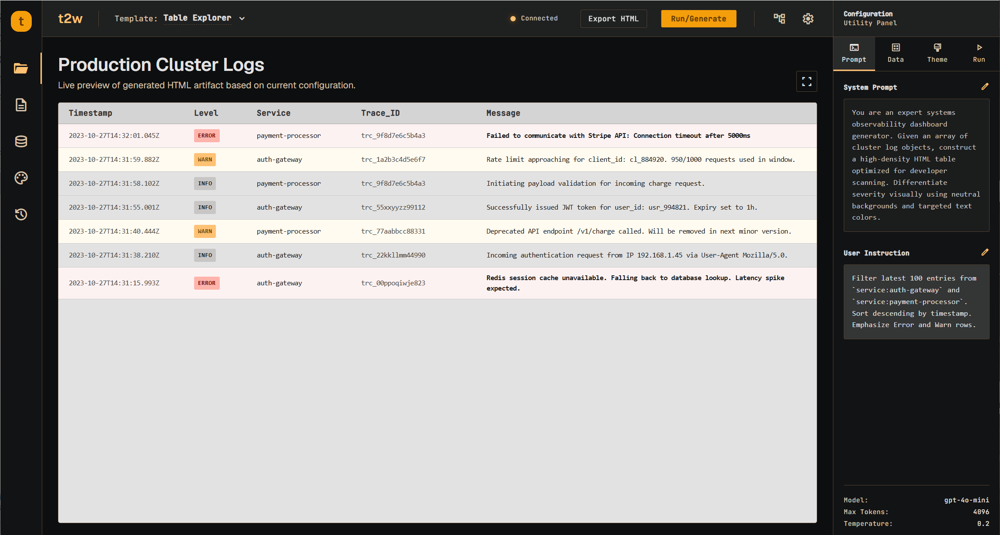
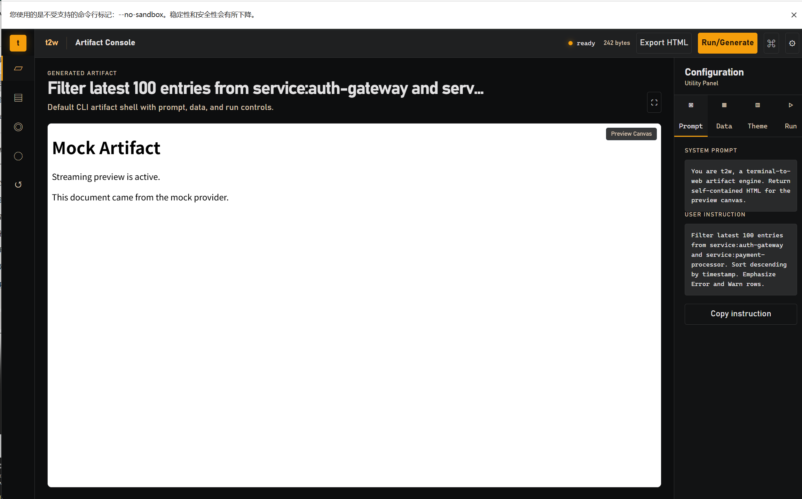
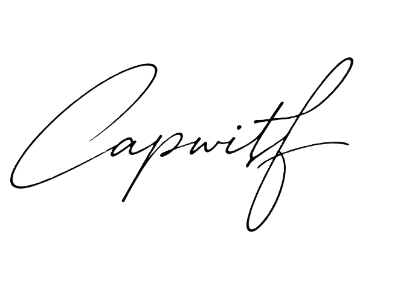

[English](README.md) | [中文](README_zh.md)

<div align="center">
  <h1>t2w</h1>
  <p>Turn terminal input into a local HTML artifact.</p>
  <p>
    <a href="https://github.com/capwitf/t2w/releases/latest">Download</a>
    ·
    <a href="#usage">Usage</a>
    ·
    <a href="#roadmap">Roadmap</a>
  </p>
</div>

## Preview

| Artifact Shell | Studio |
| --- | --- |
|  |  |

## Features

- CLI first: pipe text in, get an HTML page out.
- Live preview while the provider is streaming.
- Local Studio for editing sessions, checking run state, previewing output, and downloading HTML.
- Two providers today: `mock` for local tests, `anthropic` for real generation.
- Local `SKILL.md` discovery and prompt injection.
- No frontend build step. Studio assets are embedded in the Rust server.

## Install

Download the latest package from [Releases](https://github.com/capwitf/t2w/releases/latest).

| Platform | Package |
| --- | --- |
| Windows x64 | [t2w-windows-x86_64.zip](https://github.com/capwitf/t2w/releases/latest/download/t2w-windows-x86_64.zip) |
| macOS Apple Silicon | [t2w-macos-aarch64.tar.gz](https://github.com/capwitf/t2w/releases/latest/download/t2w-macos-aarch64.tar.gz) |
| macOS Intel | [t2w-macos-x86_64.tar.gz](https://github.com/capwitf/t2w/releases/latest/download/t2w-macos-x86_64.tar.gz) |
| Linux x64 | [t2w-linux-x86_64.tar.gz](https://github.com/capwitf/t2w/releases/latest/download/t2w-linux-x86_64.tar.gz) |

Windows:

```powershell
Expand-Archive .\t2w-windows-x86_64.zip -DestinationPath .
cd .\t2w-windows-x86_64
.\t2w.exe --provider mock --no-open "build a clean operations dashboard as HTML"
.\t2w-studio.exe --port 3000
```

macOS / Linux:

```bash
tar -xzf t2w-linux-x86_64.tar.gz
cd t2w-linux-x86_64
chmod +x t2w t2w-studio
./t2w --provider mock --no-open "build a clean operations dashboard as HTML"
./t2w-studio --port 3000
```

Open Studio at [http://127.0.0.1:3000/](http://127.0.0.1:3000/).

## Usage

Run from source:

```powershell
cargo run -p agent-cli --bin t2w -- --provider mock --no-open "build a clean operations dashboard as HTML"
```

Start Studio:

```powershell
cargo run -p agent-cli --bin t2w-studio -- --port 3000
```

Install from source:

```powershell
cargo install --path crates/agent-cli --bin t2w --bin t2w-studio --force
```

Pipe a file into the CLI:

```powershell
Get-Content .\access.log | t2w "build an incident dashboard from these logs"
```

CLI options:

```text
t2w "<instruction>"
  --provider anthropic|mock
  --skill <name>
  --skills-dir <path>
  --config <path>
  --artifacts-dir <path>
  --no-open
  --no-snapshot
```

Snapshots are written to `.t2w/artifacts/` by default.

## Provider And Cost

Use `mock` for local checks. It does not call a model and does not spend tokens.

Real generation uses Anthropic:

```powershell
$env:T2W_ANTHROPIC_API_KEY = "your-key"
$env:T2W_ANTHROPIC_MODEL = "claude-sonnet-4-5"
```

Token use depends on the instruction, stdin content, selected skills, and generated HTML size.

## Skills

t2w can read local `SKILL.md` files and add matching guidance to the prompt.

Default roots:

- `./skills`
- `./.t2w/skills`

Example: [`examples/skills/log-dashboard/SKILL.md`](examples/skills/log-dashboard/SKILL.md)

## Release

Release packages are built by [`.github/workflows/release.yml`](.github/workflows/release.yml).

```bash
git tag v0.1.0
git push origin v0.1.0
```

The workflow uploads Windows, macOS, and Linux archives with `.sha256` files.

## Roadmap

### v0.1.x

- Keep the CLI and Studio v1 shape stable.
- Publish portable packages for Windows, macOS, and Linux.
- Keep examples and screenshots current.

### v0.2 - Reinforcement Formula

Make generation less dependent on one raw prompt.

- prompt formula: role, input, output contract, visual rules
- data formula: normalize stdin before generation
- theme formula: stable layout, density, typography, and color choices
- run formula: score output, find gaps, repair weak HTML
- presets for logs, tables, dashboards, reports, and inspectors

### Later

- Persistent Studio sessions.
- More providers and model presets.
- Skill packs and sandbox boundaries.
- Real TUI next to the browser Studio.
- Native installers after the portable packages settle.

## Development

```powershell
cargo fmt --all --check
cargo clippy --workspace --all-targets -- -D warnings
cargo test --workspace
cargo build --release
```

## Contact

- Author: [capwitf](https://github.com/capwitf)
- Email: [cbq6180@gmail.com](mailto:cbq6180@gmail.com)

## License

MIT. See [LICENSE](LICENSE).

<p align="center">
  
</p>
